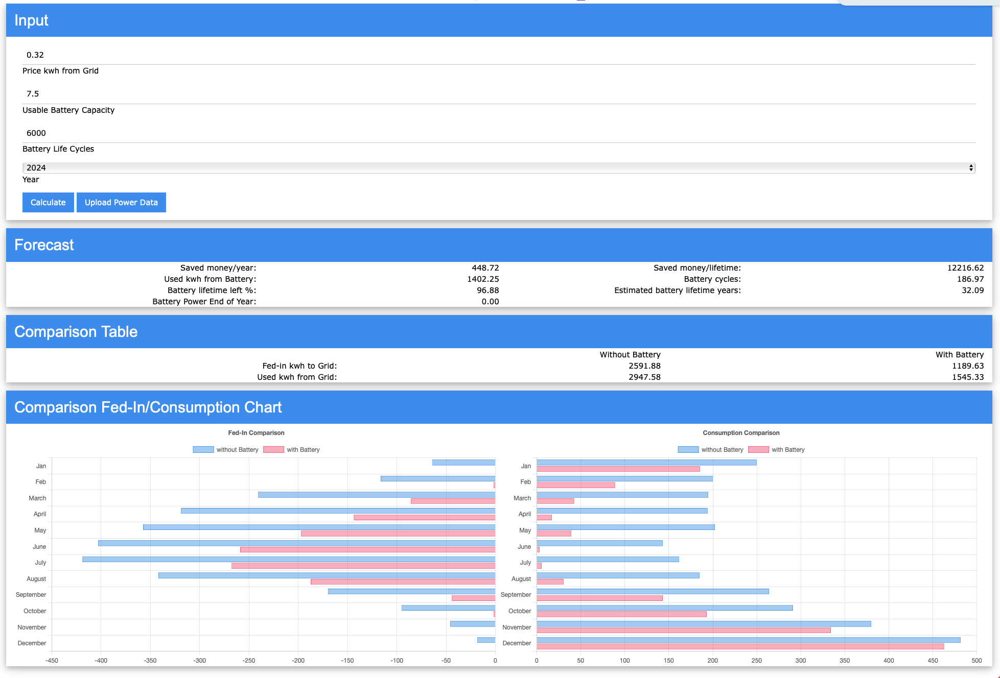

= Battery Forecast

This is just a simple private calculation, how much money a battery used together with the existing photovoltaic system would save.

You can upload the exported files from NÖ Netz Gmbh of the SmartMeter. 
Based on this data it's calculated based on

* your prefered battery capacity
* the lifetime cycles of the battery
* the consumption costs per kwh from the grid
* the year to calculate

you get the selected year

* the saved money
* the remaining lifetime cycles of the battery
* the estimated years until the lifetime cycles are reached
* some more statistics
* a graph where the power data with and without battery is compared

== How to use it

* Checkout
* start in dev mode (e.g. in the console in *nix systems: ./gradlew quarkusDev)
* click on the printed link(by default it should be http://localhost:8080)
* have fun ;)

