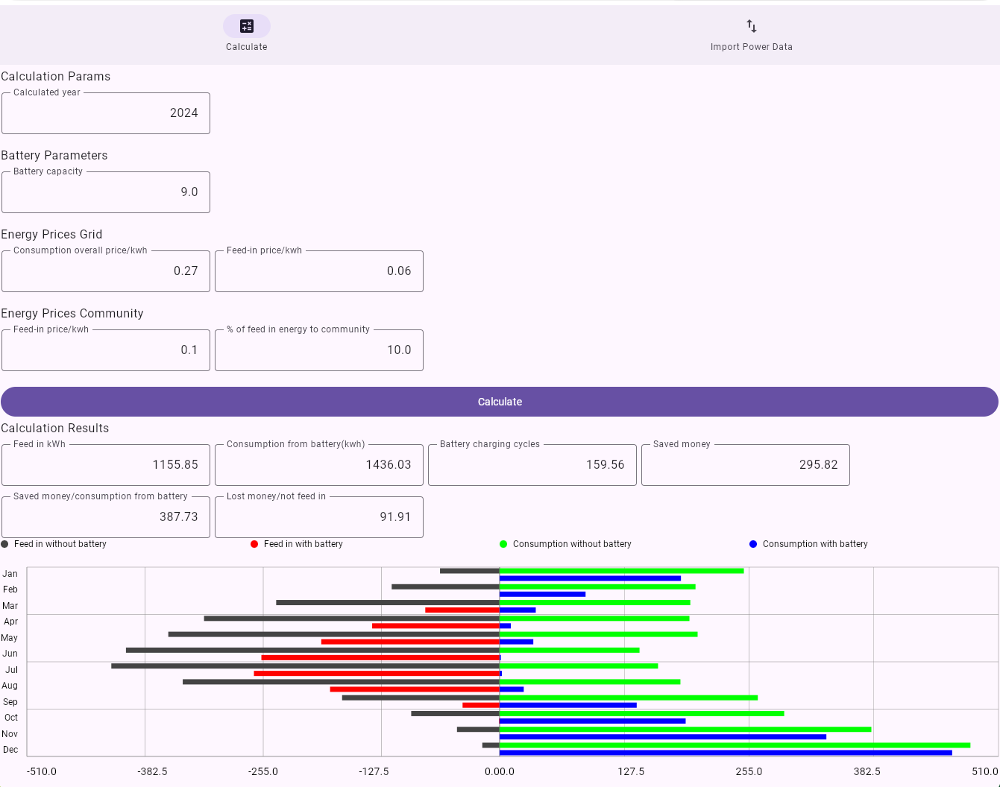

= Battery Forecast

This is just a simple private calculation, how much money a battery used together with the existing photovoltaic system would save.

You can upload the exported files from NÖ Netz Gmbh of the SmartMeter. 
Based on the energy data and

* your preferred battery capacity
* the consumption costs per kwh from the grid and community
* the year to calculate

the

* the saved money
* the battery chargin cycles and
* some more statistics

are calculated.

== How to use it

* Open https://meks77.github.io/battery-forecast/
* Click on Import
* Import the consumption file and the feed in file for one year
* switch to calculate
* adapt the calculation params
* click on "Calculate"
* verify the result

